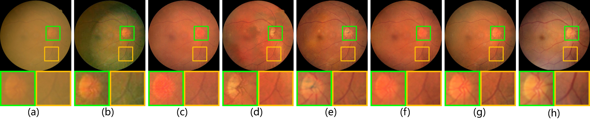

# Restoration-of-Cataract-Images-via-Domain-Generalization

code for **Domain Generalization in Restoration of Cataract Fundus Images via High-frequency Components**.

We propose a DG-based restoration model to effectively restore cataractous images unseen in training without any paired or annotated data.

The code of this study will be released soon.

**Result:**


Comparison between the cataract restoration algorithms. (a) cataract fundus image. (b) SGRIF [1]. (c) pix2pix [2]. (d) Luo et al. [3]. (e) CofeNet [4]. (f) Li et al. [5]. (g) The proposed method. (h) clear image after surgery.

## Prerequisites

\- Win10

\- Python 3

\- CPU or NVIDIA GPU + CUDA CuDNN

## Environment (Using conda)

conda install numpy pyyaml mkl mkl-include setuptools cmake cffi typing opencv-python

conda install pytorch torchvision -c pytorch # add cuda90 if CUDA 9

conda install visdom dominate -c conda-forge # install visdom and dominate

## Visualization when training

python -m visdom.server

### To open this link in the browser

http://localhost:8097/

## Command to run (root directory is the project root directory)

### train

```
python train.py --dataroot ./datasets/cataract_0830 --name train_project --model pixDA --netG unet_256 --input_nc 3 --direction AtoB --dataset_mode cataract --norm batch --explanation train_project --num_test 126 --pool_size 50 --batch_size 8 --n_epochs 150 --n_epochs_decay 50 --test_when_train
```

### test

```
python test.py --dataroot ./datasets/cataract_0830 --name train_project --model pixDA --netG unet_256 --input_nc 3 --direction AtoB --dataset_mode cataract --norm batch --explanation train_project --num_test 126
```

### eval

```
python eval.py --dataroot ./datasets/cataract_0830 --name train_project --model pixDA --netG unet_256 --input_nc 3 --direction AtoB --dataset_mode cataract --norm batch --explanation train_project --num_test 126
```

# Reference

[1]Jun Cheng et al.,   “Structure-preserving guided retinal image filtering and its application for optic disk analysis,”IEEE TMI, vol. 37, no. 11, pp. 2536–2546, 2018.

[2]Phillip  Isola  et  al.,  “Image-to-image  translation  with conditional adversarial networks,”  in CVPR, 2017, pp.1125–1134.

[3]Yu hao  Luo  et  al.,   “Dehaze  of  cataractous  retinal  images using an unpaired generative adversarial network,”JBHI, 2020.

[4]Ziyi  Shen  et  al.,   “Understanding  and  correcting  low-quality  retinal  fundus  images  for  clinical  analysis,” arXiv preprint arXiv:2005.05594, 2020.

[5]Heng Li et al.,  “Restoration of cataract fundus images via  unsupervised  domain  adaptation,”   in ISBI.  IEEE,2021, pp. 516–520.