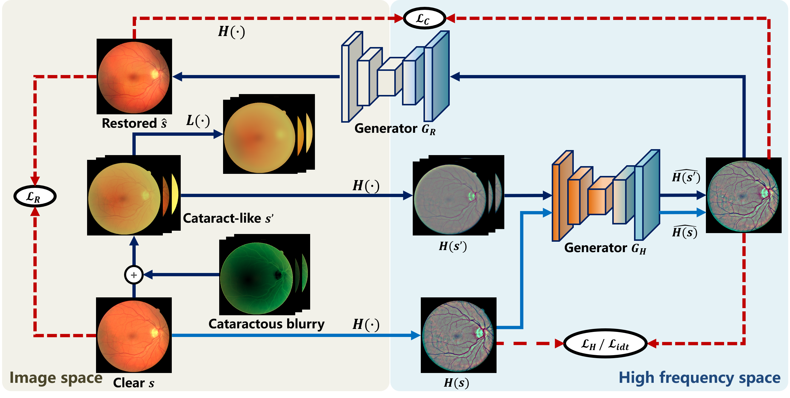

# Restoration-of-Cataract-Images-via-Domain-Generalization
Code for Domain Generalization in Restoration of Cataract Fundus Images via High-frequency Components [1]. 

This code is inherited from [our previous work [7]](https://github.com/liamheng/Restoration-of-Cataract-Images-via-Domain-Adaptation)

Unlike the previous work, this model is based on domain generalization, free from the target domain data in training.

## Domain Generalization in Restoration of Cataract Fundus Images via High-frequency Components

<div align="left">
    
</div>

Fig. 1. Overview of the proposed model. The bottom of (a) and (b) exhibit that $k$ cataract-like fundus images $s'_i$ are randomly synthesized from an identical clear image $s$ to cover the potential target domain $T$.On the top part, HFCs $H(\cdot)$ are extracted from the images to reduce the domain shift and then achieve domain alignment. Finally, the clear image is reconstructed from the aligned HFCs.

<div align="left">
    
</div>

Fig. 2. Overview of the proposed model. Cataract-like images $s’$ are synthesized from clear image $s$ using  DR to construct source domains. $H(\cdot)$ and  $L(\cdot)$ are the extraction of HFCs and LFCs. Then, DIFs are acquired by domain alignment using HFCs and generator $G_H$. Finally, generator $G_R$ reconstructs the clear fundus image from the aligned HFCs.

<div align="left">
    
</div>

Fig. 3. Comparison between the cataract restoration algorithms. (a) cataract fundus image. (b) SGRIF [2]. (c) pix2pix [3]. (d) Luo et al. [4]. (e) CofeNet [5]. (f) Li et al. [6]. (g) The proposed method [1]. (h) clear image after surgery.

# Prerequisites

\- Win10

\- Python 3

\- CPU or NVIDIA GPU + CUDA CuDNN

## Environment (Using conda)

```
conda install numpy pyyaml mkl mkl-include setuptools cmake cffi typing opencv-python

conda install pytorch torchvision -c pytorch # add cuda90 if CUDA 9

conda install visdom dominate -c conda-forge # install visdom and dominate
```

## Data preparation

Go to the root directory of this project, and run the following command:

### Preparing the simulation image

```shell
python util/cataract_simulation.py
```

### Get the mask of source image and target image

Get the mask of source image

```shell
python util/get_mask.py --image_dir ./images/drive_cataract/source --output_dir ./images/drive_cataract/source_mask --mode pair
```

Copy the target image into './images/drive_cataract/target', and run the following command.

```shell
python ./util/get_mask.py --image_dir ./images/drive_cataract/target --output_dir ./images/drive_cataract/target_mask --mode single
```

### Dataset and dataloader

You can also design your own dataset in data/xx_dataset.py for your own dataset format by imitating the script data/cataract_guide_padding_dataset.py.

Note that mask is needed in the model.


## Visualization when training

python -m visdom.server

Then, open this link in the browser

http://localhost:8097/

## Trained model's weight

For the model of "Domain Generalization in Restoration of Cataract Fundus Images via High-frequency Components", please download the pretrained model from this link:

https://drive.google.com/file/d/1ejnisgBh8aolGd5qcglWW-RBfc1QqLdj/view?usp=sharing

Then, place the directory in project_root/checkpoints/RCDG_drive, so that we can get the file like project_root/checkpoints/RCDG_drive/latest_net_GH.pth

With this trained weight, we can use the following command to inference.

```
python test.py --dataroot ./images/drive_cataract --name RCDG_drive_trained --model RCDG --dataset_mode cataract_guide_padding --eval
```

# Model Training, testing and inference

## Train

```
python train.py --dataroot ./images/drive_cataract --name RCDG_drive --model RCDG --dataset_mode cataract_guide_padding --batch_size 8 --n_epochs 150 --n_epochs_decay 50
```

## Test & inference

```
python test.py --dataroot ./images/drive_cataract --name RCDG_drive --model RCDG --dataset_mode cataract_guide_padding --eval
```

# Reference

[1] Liu H ,  Li H ,  Ou M , et al. Domain Generalization in Restoration of Cataract Fundus Images via High-frequency Components[C]// 2022 IEEE 19th International Symposium on Biomedical Imaging (ISBI). IEEE, 2022.

[2] Cheng J ,  Li Z ,  Gu Z , et al. Structure-Preserving Guided Retinal Image Filtering and Its Application for Optic Disk Analysis[J]. IEEE TRANSACTIONS ON MEDICAL IMAGING MI, 2018.

[3] Isola P ,  Zhu J Y ,  Zhou T , et al. Image-to-Image Translation with Conditional Adversarial Networks[C]// IEEE Conference on Computer Vision & Pattern Recognition. IEEE, 2016.

[4] Luo Y ,  K  Chen,  Liu L , et al. Dehaze of Cataractous Retinal Images Using an Unpaired Generative Adversarial Network[J]. IEEE Journal of Biomedical and Health Informatics, 2020, PP(99):1-1.

[5] Z. Shen, H. Fu, J. Shen, and L. Shao, “Modeling and enhancing lowquality retinal fundus images,” IEEE transactions on medical imaging, vol. 40, no. 3, pp. 996–1006, 2020.

[6] Li H, Liu H, Hu Y, et al. Restoration Of Cataract Fundus Images Via Unsupervised Domain Adaptation[C]//2021 IEEE 18th International Symposium on Biomedical Imaging (ISBI). IEEE, 2021: 516-520.

[7] Li H, Liu H, Hu Y, et al. An Annotation-free Restoration Network for Cataractous Fundus Images[J]. IEEE Transactions on Medical Imaging, 2022.

# Citation

```
@article{li2022annotation,
  title={An Annotation-free Restoration Network for Cataractous Fundus Images},
  author={Li, Heng and Liu, Haofeng and Hu, Yan and Fu, Huazhu and Zhao, Yitian and Miao, Hanpei and Liu, Jiang},
  journal={IEEE Transactions on Medical Imaging},
  year={2022},
  publisher={IEEE}
}
@inproceedings{li2021restoration,
  title={Restoration Of Cataract Fundus Images Via Unsupervised Domain Adaptation},
  author={Li, Heng and Liu, Haofeng and Hu, Yan and Higashita, Risa and Zhao, Yitian and Qi, Hong and Liu, Jiang},
  booktitle={2021 IEEE 18th International Symposium on Biomedical Imaging (ISBI)},
  pages={516--520},
  year={2021},
  organization={IEEE}
}
```